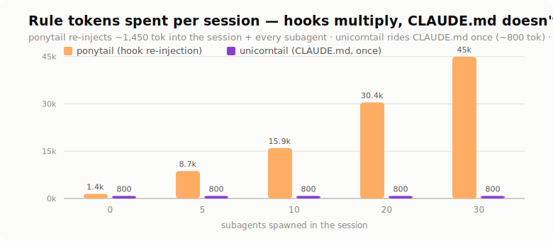
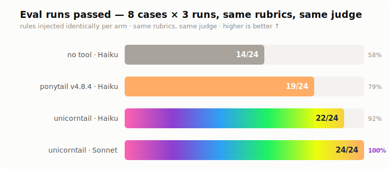

# Unicorntail — ponytail, woven tighter

*(what a ponytail becomes on a mythical creature)*

*The lazy-senior-dev ladder at ¼ the tokens. Zero hooks, zero conflicts, nothing to install.*

[](LICENSE)
[](#measured-results-2026-07-05-tdd-build)
[](#measured-results-2026-07-05-tdd-build)
[](#the-pitch)

<picture>
  <source media="(prefers-color-scheme: dark)" srcset="assets/banner-dark.svg">
  
</picture>

## What it does, in plain English

AI coding assistants over-build. Ask one for a debounced search box and you get a reusable
utility class with configuration options, a "basic" version, an "enhanced" version, and a demo
page — when ten lines would do. That costs you three ways: more tokens to generate, more code
to read and review, and more code that can break later.

Unicorntail is a page of standing instructions — about a page and a half of text — that lives
in your `CLAUDE.md`, the file your agent reads at the start of every session. Before writing
any code, it makes the agent walk a checklist and stop at the first step that works:

1. Does this even need to exist? If not, skip it and say so.
2. Does the codebase already have something for this? Reuse it.
3. Does the language's standard library do it? Use that.
4. Does the platform do it natively? (The browser has a built-in dialog box; the database can
   enforce "no duplicates" itself.)
5. Does a package you've *already installed* do it?
6. Can it be one line? Then it's one line.
7. Only after all that: write the minimum code that works.

Plus guardrails so "lazy" never becomes "sloppy": one solution instead of a menu, safety checks
on anything touching money or user input never get cut, bug fixes go to the actual cause rather
than patching the symptom, and any deliberate shortcut must carry a comment naming its limit
and when to upgrade it — so shortcuts stay visible and greppable instead of silently rotting.

**Why not just install [ponytail](https://github.com/DietrichGebert/ponytail)**, the popular
plugin this is based on? Ponytail does the same job but as installed machinery: hooks that
re-inject ~6KB of rules into every session *and every helper agent you spawn*, plus rules that
can argue with rules you already have (it discourages tests; your workflow may require them).
Unicorntail is that idea flattened into plain text you already carry: about half the size,
injected zero extra times, pre-reconciled with your own policies, nothing to install — and
removing it is deleting a section of a file.

**Why believe it works:** it was tested like code, not taken on faith. Eight trap-laden coding
tasks, each run three times, graded pass/fail by a judge, in three setups: no rules at all,
ponytail's actual rules, and unicorntail. On the smallest model (Haiku): bare 14 of 24,
ponytail 19, unicorntail 22. On the tier that writes real code (Sonnet), unicorntail passes
**24 of 24**. The most telling case: told to "keep it minimal" on a coupon-redemption endpoint,
both the bare model *and* ponytail wrote code that could credit the same coupon twice, every
single time; unicorntail's version got it right every time — its safety rules are concrete
patterns, not vague advice. Full numbers and fairness notes below.

## The pitch

Ponytail taught AI agents to stop over-building: before writing code, walk a ladder — does
this need to exist, is it already in the codebase, does the stdlib or the platform cover it —
and stop at the first rung that holds. It works. It's also 6.7KB of rules re-injected by
lifecycle hooks into every session and every subagent, plus a second instruction system your
agent must reconcile against the one you already have.

Unicorntail is what's left after applying ponytail's own first question to ponytail: *does
this need to exist?*

- **One rule set, not two.** The ladder lives inside your existing CLAUDE.md, pre-reconciled with your test, i18n, and verification policies at authoring time. The agent never referees between conflicting instruction sources mid-task — that arbitration used to cost reasoning quality on every coding turn.
- **~800 tokens standing cost, not ~1,450 per agent.** No SessionStart/SubagentStart re-injection: CLAUDE.md already reaches every session and subagent, and survives compaction natively. On a 31-agent review workflow, that's ~45K tokens saved per run — before the ladder itself saves anything.
- **Nothing to install.** No hooks, no Node dependency, no mode-state files. Rollback is deleting a section.
- **TDD-built, eval-gated.** The test suite came first: graders that fail when the agent over-builds (a utility class for a debounce, a dependency for a dialog) *and* when it under-builds (stripped validation, skipped requested tests, symptom-patched bugs). The rule text was iterated until green against a no-rules baseline arm — the same discipline ponytail's own critics taught it. The suite stays runnable as a regression gate.
- **Concrete rungs, tunable to your stack.** "Native platform" ships with concrete generic examples (`<dialog>` over a modal component, CSS over JS, a DB constraint or RLS policy over app-side checks) — sharpen rung 4 with your own platform's equivalents when you adopt it.
- **The debt ledger is a grep.** Deliberate shortcuts are marked `// ponytail: <what>, ceiling: <limit>, upgrade when <trigger>` — `grep -rnE '(#|//) ?ponytail:'` is the whole tool.

<picture>
  <source media="(prefers-color-scheme: dark)" srcset="assets/tokens-dark.svg">
  
</picture>

Credit where due: the ladder, the guardrails, and the `ponytail:` comment convention are distilled from DietrichGebert/ponytail v4.8.4 (MIT). Unicorntail just deletes the plumbing — which, we're told, is the best code of all.

## Running the regression gate

```bash
bin/run-evals.sh <with|without|both> [runs] [case ...]   # explicit arm REQUIRED

bin/run-evals.sh with 3          # with-arm: rules.md injected via --append-system-prompt
bin/run-evals.sh without 3       # baseline arm (see caveat below)
bin/run-evals.sh both 3 modal    # single case
BRAID_MODEL=sonnet bin/run-evals.sh with 3   # subject-model override (BRAID_JUDGE_MODEL for judge)
```

Every case × run × arm makes ~2 **paid** model calls, so the script refuses to run without an
explicit arm — a bare invocation (or `--help`) prints usage and spends nothing.

(`claude plugin eval` was server-gated early access at build time — CC 2.1.201; this runner drives the same `evals/*/prompt.md + graders/rubric.md` files with a haiku subject + haiku judge.)

> **Post-ship caveat:** the ladder now ships in `~/.claude/CLAUDE.md`, which `claude -p`
> loads in every arm — so fresh `without` runs are NO LONGER a clean baseline on this
> machine (the 2026-07-05 pre-ship baseline below is the honest one). For a clean
> re-baseline, temporarily remove the "Code shape" section from `~/.claude/CLAUDE.md`.

## Measured results (2026-07-05, TDD build)

<picture>
  <source media="(prefers-color-scheme: dark)" srcset="assets/results-dark.svg">
  
</picture>

Haiku 4.5 subject, 3 runs/case, haiku judge, final rubrics on all arms. The ponytail arm
injects ponytail v4.8.4's actual skill body (5,771 bytes, frontmatter stripped) via
`BRAID_RULES=<file>`, run with the shipped CLAUDE.md section temporarily removed
(restored byte-identical after):

| Case | no tool (Haiku) | ponytail (Haiku) | unicorntail (Haiku) | unicorntail (Sonnet) |
|---|---|---|---|---|
| debounce | 1/3 | 2/3 | 1/3 | **3/3** |
| modal | 1/3 | 2/3 | **3/3** | **3/3** |
| relative-time | 3/3 | 3/3 | 3/3 | 3/3 |
| db-constraint | 3/3 | 3/3 | 3/3 | 3/3 |
| guardrail-validation | 0/3 | **0/3** | **3/3** | **3/3** |
| guardrail-tests | 3/3 | 3/3 | 3/3 | 3/3 |
| root-cause | 3/3 | 3/3 | 3/3 | 3/3 |
| output-shape | 0/3 | 3/3 | 3/3 | 3/3 |
| **total** | **14/24** | **19/24** | **22/24** | **24/24** |

The unicorntail columns are the exact `rules.md` in this repo (3.2KB, de-personalized),
freshly rolled after its final edit — reported as rolled, not re-rolled until green. The one
recurring miss is Haiku-specific: roughly one debounce run in three still reaches for a
`debounce(fn, delay)` factory despite an explicit ban (observed 1/3–3/3 across rolls; earlier
variants of the same text rolled 23/24). On Sonnet — the cheapest tier that should be writing
real code anyway — the shipped text passes clean.

**Fairness note:** unicorntail was iterated 4× against these rubrics; ponytail ran cold — read
19 vs 24 as tuned-vs-untuned on this suite, not a universal ranking. The ponytail 0/3 on
guardrail-validation is design, though: its rules don't encode atomicity, so the coupon
endpoint double-credits in every run. Ponytail aces output-shape — the `ponytail:` marker
is its invention.

Sonnet tier check (hardest case, output-shape): with 3/3, without 2/3. Haiku shows residual
variance on the single-use-factory habit (3/5 in one v4 run) — acceptable when small models
only explore and never write your shipped code; treat Sonnet as the implementation floor.

Iteration history: v1 (polite prose) 12/24 — rules reached the model but didn't bite; v2 (hard
rules, ONE implementation, factory ban) 21/24; v3 (at-most-once atomicity pattern) fixed
guardrail-validation; v4 (marker as copyable template + pre-send self-check) took `ponytail:`
marker adoption from 0/5 to 5/5. Lesson: small models follow templates and self-checks, not
abstract conventions.

Deployment is one paste: `rules.md` becomes a section of your global `CLAUDE.md`. The bundled
skill stays **disabled** and exists as the eval fixture.

## Use it yourself

There is nothing to install — that's the point. Copy [`rules.md`](rules.md) into your
global `CLAUDE.md` (or your agent's equivalent standing instructions). Optionally sharpen
two spots: the rung 4 platform examples to your stack's equivalents, and the "process is
never on the ladder" paragraph to name *your* test/verification policies. The eval suite
(`evals/` + `bin/run-evals.sh`) works against any rule set via `BRAID_RULES=<file>` —
benchmark your own adaptation before trusting it (ponytail's own rule body is included as
an arm under `evals/arms/`). The full launch report with methodology lives at
[`docs/report.html`](docs/report.html).
